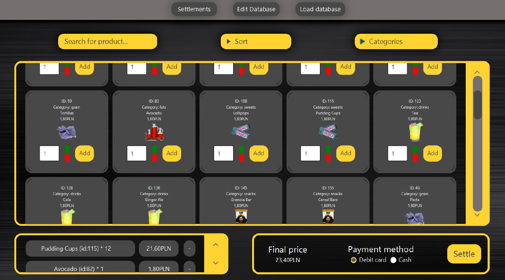
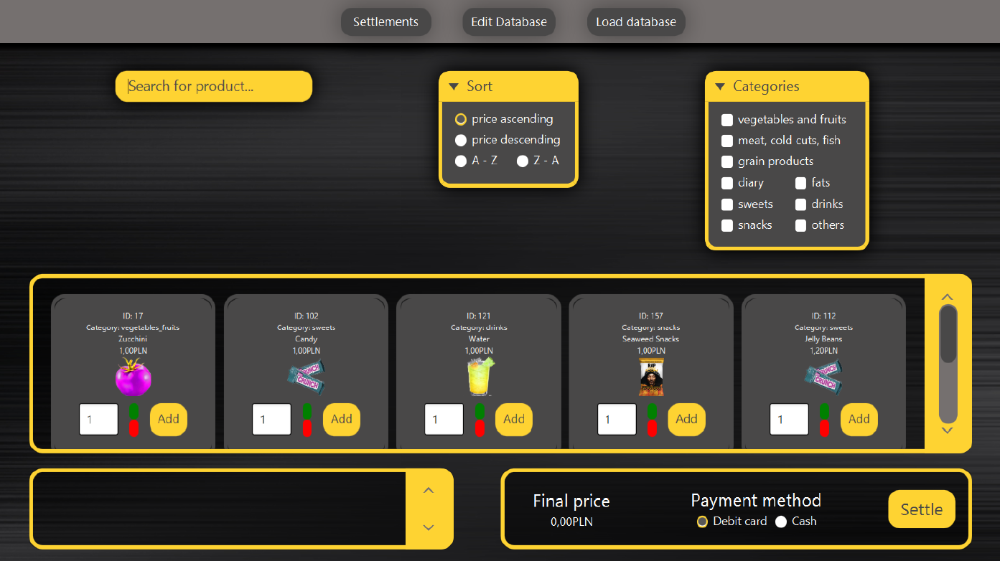
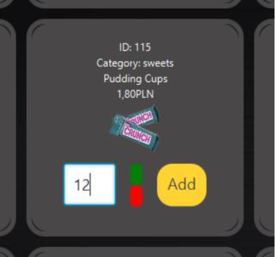
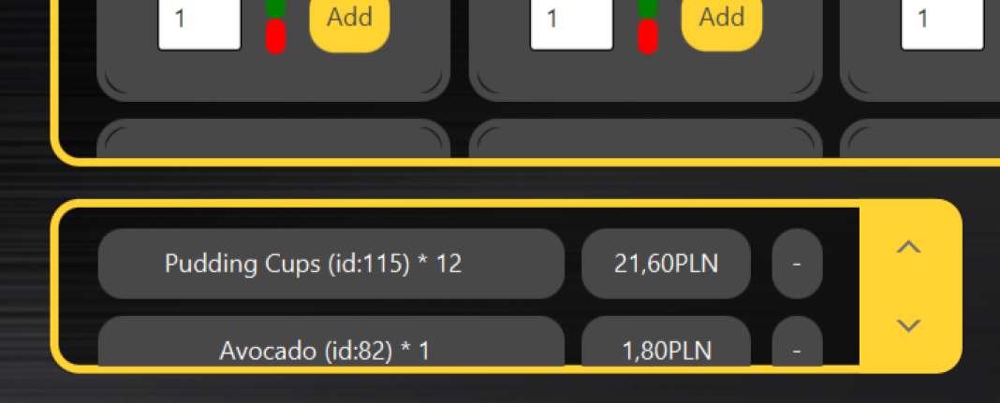
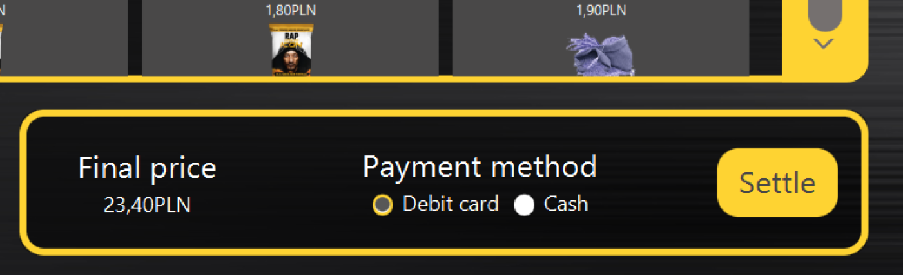
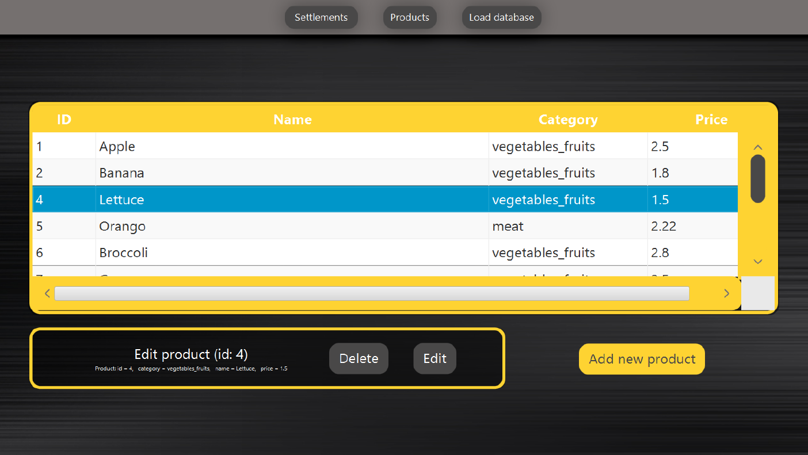
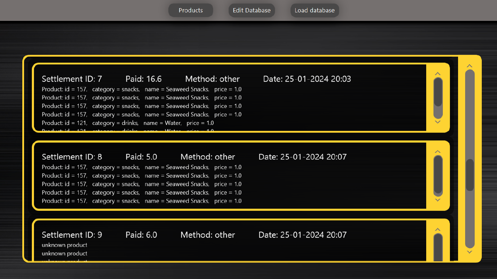
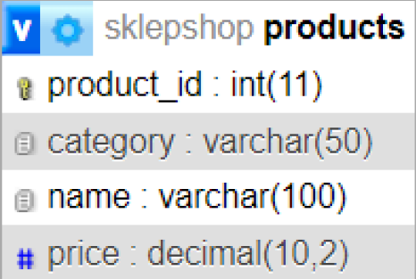
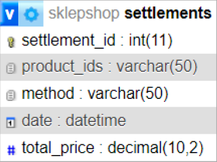

# SklepShop

## Cel Aplikacji oraz Ogólny Opis

Celem aplikacji jest stworzenie kompleksowego systemu obsługi sklepu, który umożliwia zarządzanie produktem, przeglądanie oferty, dodawanie produktów do koszyka, a następnie finalizację zakupu. Aplikacja ma na celu dostarczenie wygodnego i intuicyjnego interfejsu dla klientów, a także efektywnych narzędzi administracyjnych dla obsługi produktów.

### Kluczowe Komponenty Aplikacji:

- **EditProductsDB**: Zarządzanie bazą danych produktów.
- **Products_LoadProducts**: Dynamiczne ładowanie produktów do interfejsu użytkownika.
- **Products_Management**: Zarządzanie koszykiem zakupowym.
- **Settlements**: Przechowywanie informacji o dokonanych transakcjach.
- **AddedProduct**, **Product**, **Settlement**: Klasy definiujące struktury danych.

## Wymagania Systemowe

Aby efektywnie korzystać z aplikacji, użytkownikowi zaleca się spełnienie następujących wymagań systemowych:

- **System Operacyjny**: Kompatybilność z systemami operacyjnymi z rodziny Windows, macOS oraz Linux.
- **Moc Obliczeniowa**: Nie wymaga znaczących zasobów sprzętowych, ale zaleca się wydajny procesor i wystarczającą ilość pamięci RAM.
- **Dysk Twardy**: Wolne miejsce na dysku twardym na przechowywanie aplikacji oraz lokalnej bazy danych.
- **Rozdzielczość Ekranu**: Zalecana minimalna rozdzielczość ekranu umożliwiająca wygodne korzystanie z interfejsu graficznego.

## Diagram ERD (Entity-Relationship Diagram)

### Tabela products

- **product_id** (int, klucz główny): Unikalny identyfikator produktu.
- **name** (varchar): Nazwa produktu.
- **category** (varchar): Kategoria produktu.
- **price** (double): Cena produktu.

### Tabela settlements

- **settlement_id** (int, klucz główny): Unikalny identyfikator rozliczenia.
- **products_ids** (varchar): Identyfikatory produktów zawartych w danym rozliczeniu.
- **method** (varchar): Metoda płatności.
- **date** (varchar): Data i czas dokonania rozliczenia.
- **total_price** (double): Łączna wartość produktów w danym rozliczeniu.

## Instrukcja Instalacji

1. **Baza Danych**: Skonfiguruj lokalną bazę danych SQLite.
2. **Środowisko Java**: Upewnij się, że na Twoim systemie jest zainstalowane środowisko wykonawcze Java (JRE) w wersji 8 lub nowszej.
3. **Biblioteki Zewnętrzne**: Pobierz niezbędne pliki JAR z oficjalnej strony Hibernate i dodaj je do projektu.
4. **Uruchomienie Aplikacji**: Uruchom projekt za pomocą środowiska programistycznego obsługującego JavaFX lub za pomocą terminala/linii poleceń.
5. **Konfiguracja Systemu/Aplikacji/Serwerów**: Skonfiguruj bazę danych oraz dostosuj plik konfiguracyjny Hibernate.

## Opis Interfejsu Użytkownika

Aplikacja "SklepShop" oferuje przejrzysty i intuicyjny interfejs użytkownika, dostosowany do efektywnego zarządzania produktami, składania zamówień oraz przeglądania historii transakcji.

### Panel Produktów

Panel prezentuje listę produktów w postaci kafelków z możliwością filtrowania, sortowania i wyszukiwania.

### Koszyk Zakupów

Wyświetla dodane produkty wraz z cenami jednostkowymi oraz całkowitą ceną zakupów.

### Rozliczenia

Umożliwia finalizację zakupów poprzez wybór metody płatności.

### Edycja Produktów

Dostępna dla uprawnionych użytkowników, pozwala na dodawanie, usuwanie i aktualizację informacji o produktach.

### Historia Transakcji

Pozwala użytkownikowi przeglądać historię swoich dokonanych zakupów.

## Funkcjonalności

- **Przeglądanie Produktów**
- **Dodawanie Produktów do Koszyka**
- **Rozliczenia**
- **Edycja Produktów**
- **Historia Transakcji**

## Bezpieczeństwo: Zabezpieczenia i Spójność Bazy Danych

1. **Autoryzacja i Autentykacja**
2. **Spójność Bazy Danych**
3. **Zabezpieczenia przed Wstrzykiwaniem SQL**

## Dokumentacja API, Opis Metod i Klas

Dostarcza opisy metod oraz klas wraz z przykładami użycia.

## Przydatne Informacje

Aplikacja "SklepShop" to system obsługi sklepu internetowego bazujący na technologii JavaFX i Hibernate, zapewniający łatwość obsługi, elastyczność i bezpieczeństwo danych.

## Ograniczenia Aplikacji

- **Baza Danych**: Obsługuje tylko bazę danych SQLite.
- **Interfejs Użytkownika**: Wymaga dalszego dostosowania do oczekiwań użytkownika.
- **Mechanizm Autoryzacji**: Nie został jeszcze zaimplementowany.

## Zalety Aplikacji

- **Łatwość Używania**
- **Elastyczność**
- **Dokumentacja API**

---
